# Deploying a Spring Boot Application with Azure

<div style="max-width: 30rem">
    
</div>

---
## Contents
1. [Host the backend API](#host-the-backend-api)
2. [Host the database](#host-the-database)
3. [Connecting the backend to the database](#connecting-the-backend-to-the-database)

## Introduction
This guide assumes that the user already has an [Azure](https://azure.com) account.

## Host the backend API
Within your Spring project, run the following command.

```sh
mvn com.microsoft.azure:azure-webapp-maven-plugin:2.5.0:config
```

When your browser appears, sign in to Azure.

When asked, select Linux and Java 17:

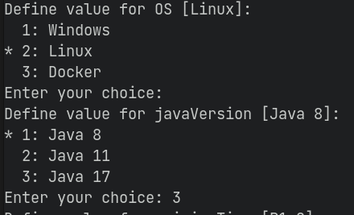

For the pricing tier, select either Basic 1 (B1, option 1) or Free 1 (F1, option 8). I recommend the latter to save on using your free Azure credit.

Confirm your choices with "y".

Deploy your app (even though it *will* be broken):

```sh
mvn package azure-webapp:deploy
```

Again, sign in when your browser appears.

Go to the [Azure Portal](https://portal.azure.com) and find your app resource:


Find "CORS":
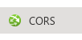

In "Allowed Origins", add `*`:
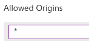

Click "Save":


## Host the database
### Step 1: Create the Azure MySQL Database
From the [Azure Portal](https://portal.azure.com), select "Create a resource".

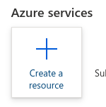

Search for "Azure Database for MySQL":
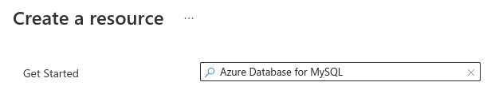

Select "Create":

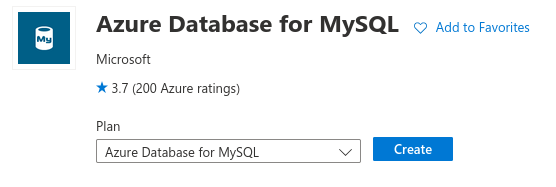

Select "Flexible server" and press "Create".

<!-- TODO: Need a new screenshot for this! -->
<!-- 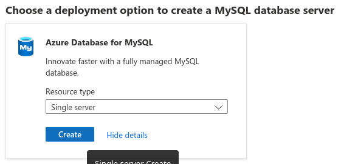 -->

Select the Resource Group that was automatically created when the backend app was deployed.
Enter a server name - it can be anything but will become part of the database URL.
Choose Version 8.0.

> **IMPORTANT**: Make sure you configure your server to something appropriate, otherwise you could be charged a lot of money!

Select "Basic" tier. I recommend selecting the lowest values for everything as this is plenty for a small scale service. The estimated monthly cost should only be able 26 USD.

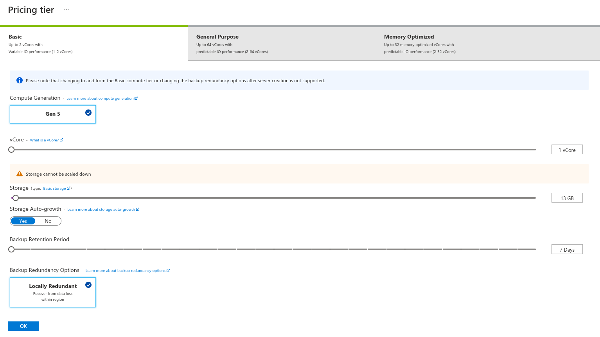

Your final configuration should look like this:

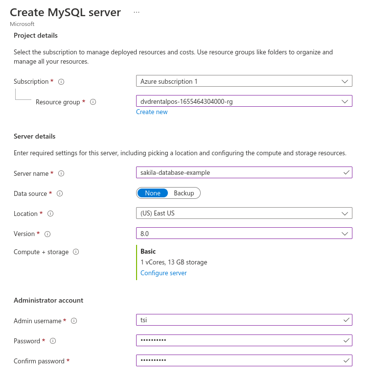

Press "Review + Create", then "Create".


Wait for Azure to finish deploying the database. Then select "Go to resource."

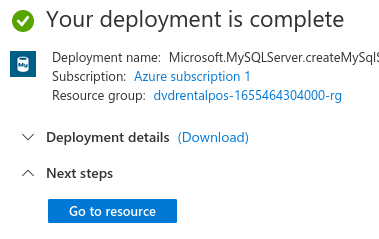

### Step 2: Configure the Firewall
Go to the "Connection security" settings:

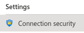

Choose "Yes" for "Allow access to Azure services", and click "Add current client IP address". This is allowing connections from your current connection (so we can initialise the sakila data), and from other Azure services (for the backend to connect to).

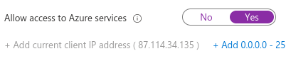

Select "Save".


### Step 3: Configure the database for sakila
Go to the "Server parameters" settings:


Search for `log_bin_trust_function_creators` and set to ON.

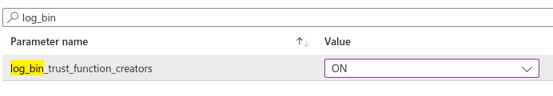

> **Information**: This allows the `sakila-schema.sql` script to load the sakila database in to the server without being blocked by the default Azure set-up, which prevents triggers being used from users not granted the SUPER permission.

Select "Save".


### Step 4: Add the sakila data

Download the [sakila data](https://downloads.mysql.com/docs/sakila-db.zip). Extract it &ndash; we will need the `sakila-schema.sql` and `sakila-data.sql`  scripts for this step.

Open MySQL Workbench. Add a new connection with the **(+)** button.

Enter the hostname, which is the name of your Azure database as a URL. In this example, the database is called `sakila-database-example`, so the hostname is: `sakila-database-example.mysql.database.azure.com`.

Enter the username, which is the username you entered during setup, then the name of your database. For this example: `tsi`.

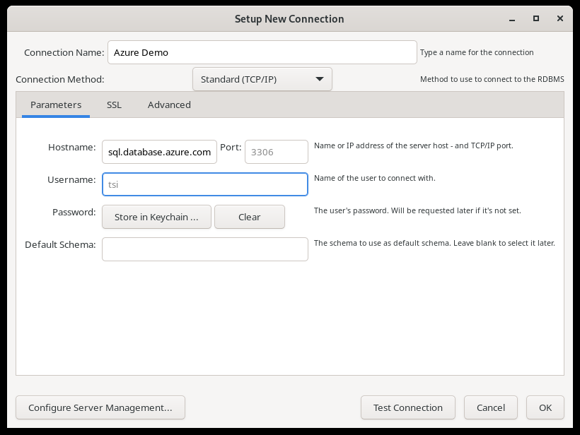

Connect to the database and enter your password when required.

Go to "File" > "Open SQL Script..." and select the `sakila-schema.sql` file. Run this query.
"Query Completed" should appear in the bottom-left of the window.

Go to "File" > "Open SQL Script..." and select the `sakila-data.sql` file. Run this query.
"Query Completed" should appear in the bottom-left of the window.

The database is now ready.

### Connecting the backend to the database
Go to the [Azure Portal](https://portal.azure.com) and find your app resource:


Find "Configuration":

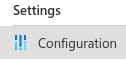

Add an "Application Setting":

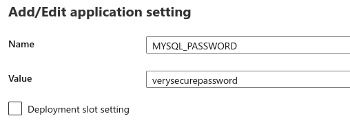

Click "Save":


Update the `application.properties` file in your project:

```properties
#spring.jpa.hibernate.ddl-auto=update
spring.datasource.url=jdbc:mysql://sakila-database-example.mysql.database.azure.com:3306/sakila
spring.datasource.username=tsi
spring.datasource.password=${MYSQL_PASSWORD}
spring.datasource.driver-class-name=com.mysql.cj.jdbc.Driver
#spring.jpa.show-sql=true
```

Notice that the password is set to `${MYSQL_PASSWORD}`. This avoids saving the password in the (publicly accessible!) Git repository, and instead gets it from the application setting.

Deploy your updated app:
```sh
mvn package azure-webapp:deploy
```

Your terminal will display the URL to visit to get access to your API:

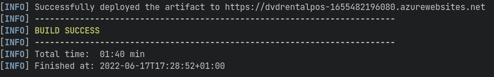

Your project is deployed!

## Troubleshooting
If you've run into problems, here are some things to check.

### Application Error
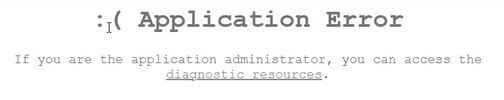

Check your `pom.xml` file. You should be building for Java 17. Make sure all of these properties are present and set:
```xml
<properties>
  <java.version>17</java.version>
  <maven.compiler.source>17</maven.compiler.source>
  <maven.compiler.target>17</maven.compiler.target>
</properties>
```

Afterwards, run:
```sh
mvn clean package azure-webapp:deploy
```
to ensure that the deployment is up-to-date.

### Running your application locally
As the password is now stored online, you need to set the `MYSQL_PASSWORD` on your computer as well. In IntelliJ, select 'Edit Configurations...':

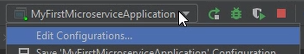

Add an environment variable `MYSQL_PASSWORD=verysecurepassword`:

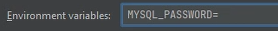

You should now be able to run it locally.

### Quota Exceeded

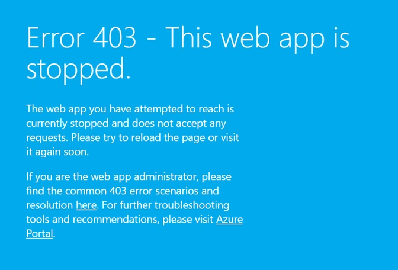

If you see this screen, your app is too powerful for the F1 tier. Don't worry, the B1 tier shouldn't cost money for 30 days.

Open your App Service Plan (ASP) resource:

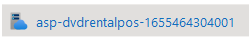

Select 'Scale up':

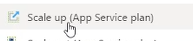

Change to the 'B1' tier and press apply:

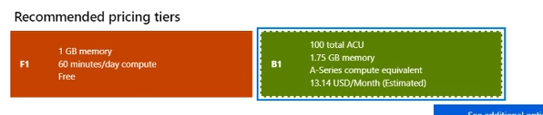

### AlwaysOn

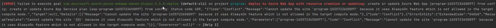

Go to the [Azure Portal](https://portal.azure.com) and find your app resource:


Find "Configuration" and go to "General settings":


Set "Always on" to "Off":

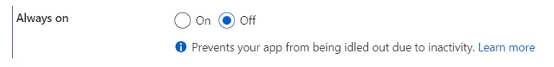

Click "Save":


